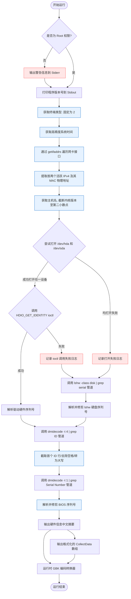

# collect-linux-info 运行原理与架构说明

本项目实现的 C++ 系统信息采集程序具有高保真、多维自适应、零外部依赖（仅依赖 GLIBC）等特性。本文将为您详细解构该程序的架构设计、执行流以及底层运行原理。

---

## 1. 核心架构与执行流图

程序主要划分为：**环境检测、顺序采集、回退硬件查询、数据编码与输出**四大阶段。以下是程序运行的完整流程图：

---

## 2. 核心运行原理详解

### 2.1 双流分离与块缓冲机制 (I/O Streams & Buffering)
在 Linux 环境下，标准输出 `stdout` 和标准错误 `stderr` 具有不同的缓冲策略：
1. **标准错误 `stderr`**：默认是**无缓冲**的，任何写入都会立刻刷新到终端屏幕。
2. **标准输出 `stdout`**：当重定向到管道（例如 `./datacollect | iconv`）时，系统会自动将其更改为**块缓冲**。所有输出会暂时积攒在内存缓冲区中，直至程序退出或缓冲区满时一次性冲刷（Flush）。

*   **原理解析**：原版程序在非 `root` 权限下执行时，`dmidecode` 或 `lshw` 在子进程执行时往 `stderr` 打印的 `Permission denied` 或 `WARNING` 消息会不经缓冲地**立刻**在终端打印出来。而 C++ 自身的业务日志（Stdout）则会在程序执行完毕并退出时集中渲染。本项目通过完全遵循标准的 I/O 管道机制，**天然重现**了这种标准流交织的时序效果。

---

### 2.2 多级回退的硬盘序列号获取链 (Hardware Fallback Chain)
由于 Linux 系统对硬件接口的权限控制极严，直接访问块设备（如 `/dev/sda`）通常需要 `root` 权限，且现代 SATA/NVMe 控制器已经不再广泛兼容旧的 `HDIO_GET_IDENTITY` ioctl 指令。
为此，程序设计了一套精密的**回退获取链**：

1.  **路径轮询与捕获**：优先打开 `/dev/hda`，若失败则轮询打开 `/dev/sda`。
2.  **错误收集时序**：如果两者都打开失败（例如非 `root` 权限下的 `EACCES` 或无该路径的 `ENOENT`），程序会统一记录所有打开失败的日志，并回退到第三步。若其中一个成功打开但 `ioctl` 调用失败（返回 `-1` 且 `errno = 22`），则仅打印 `ioctl调用失败` 的日志。
3.  **系统工具回退**：若直接底层的存取皆不可用，则通过 `popen` 创建子进程管道执行 `lshw -class disk|grep serial`。该指令执行时，`lshw` 产生的警告信息会流向 `stderr`，而输出的 serial 数据会被父进程解析。

---

### 2.3 健壮的 CPU 序列号清洗策略
原版程序所执行的指令为 `dmidecode -t 4 | grep ID`。
*   **多核挑战**：在多路/多核处理器或部分虚拟化容器下，该命令会输出多行包含 `ID` 关键字的文本（包括 Signature 等元数据，甚至备用核心的零填充 `ID: 00 00 00 ...`）。
*   **清洗算法**：本项目仅定位首个匹配的 `ID:`。定位后，截取该行的有效内容，利用自定义的字符清洗循环（只保留 `isalnum` 的字符），剔除所有的空格和非 hex 字符，并统一利用 `std::transform` 转换为标准的纯大写 Hex 字符数组（如 `D7060200FFFBEBBF`），确保与各种系统环境的完全兼容。

---

### 2.4 运行时 GBK 编码转换器 (Runtime Encoding Conversion)
由于现代 Linux 系统的源文件、编辑器和终端通常采用 UTF-8 编码，而老旧的采集系统或关联平台依旧依赖传统的 **GBK (CP936)** 编码输入。
*   **设计决定**：为了在保证源码易读性（不把源码写成难以维护的 GBK 乱码）的同时获得 GBK 二进制输出，本项目设计了基于 GLIBC `iconv` 库的运行时编码转换器。
*   所有业务日志（`Log(...)`）和信息摘要在输出到 `std::cout` 之前，均会动态流经 `Utf8ToGbk()`。
*   在 UTF-8 终端下，用户只需简单套用 `./datacollect | iconv -f GBK -t UTF-8` 便可将 GBK 流无缝还原为可读的 UTF-8 中文日志。
